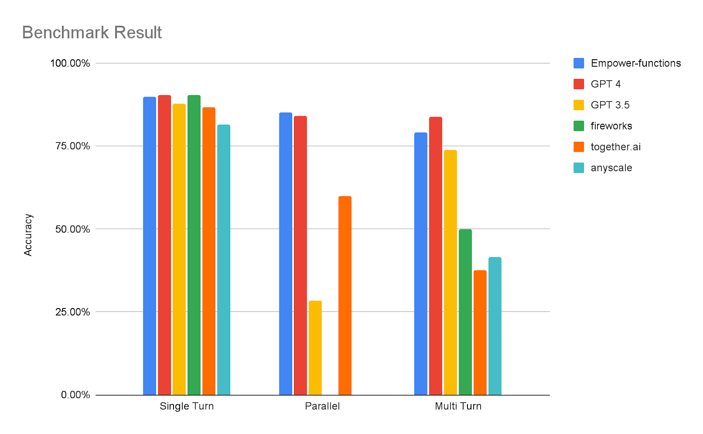

<picture>
  <a href="https://empower.dev"></a>
</picture>

# Empower Functions

Empower Functions is a family of LLMs(large language models) that offer GPT-4 level capabilities for real-world "tool using" use cases, with full compatibility support to be served as a drop-in replacement.

[Live Demo](https://app.empower.dev/chat-demo) • [Huggingface Repo](https://huggingface.co/collections/empower-dev/empower-functions-663e9a22df93b46804df75a8) • [Website](https://empower.dev) • [Discord](https://discord.gg/PVaggZ3z6r)

## Update

**New CoT (Chain of Thought) Mode:** Curious about the thought process behind the models' responses? Empower functions models now support built-in CoT mode, which includes their thought process in the response! See this [doc](/docs/inference/built-in-cot.md) for details.

## What is real world "tool using" use cases?

"tool using" refers to the ability of LLMs to interact with external APIs by recognizing when a function needs to be called and then generating JSON containing the necessary arguments based on user inputs. This capability is essential for building conversational agents and applications that convert natural language into API calls, facilitating tasks such as weather inquiries, data extraction, and interactions with knowledge bases.

Real-world use cases, particularly those involving conversational agents, often introduce complex requirements for LLMs. Models must be capable of retrieving context from multiple round of conversations([multi-turn](docs/inference/multi-turn.md)), choosing between utilizing tools or engaging in standard dialogue (['auto' mode](docs/inference/introduction.md#tools-parameter)), and asking for clarification if any parameters are missing([clarification](docs/inference/clarification.md)). Furthermore, they should integrate responses with tool outputs in a [streaming](docs/inference/streaming.md) fashion. Additionally, when multiple tools are required to complete a task, models should efficiently execute multiple functions either in parallel ([parallel calling](docs/inference/parallel-calling.md)) or sequentially with dependencies ([sequential calling](docs/inference/sequential-calling.md)).

For example, below is a screenshot demonstrating how the model is used in a medical center coordinator bot. You can explore this further in our [live demo](https://app.empower.dev/chat-demo).


## Family of Models

| Model                          | Specs                                                                                             | Links                                                                                                                                                      | Notes                                 |
| ------------------------------ | ------------------------------------------------------------------------------------------------- | ---------------------------------------------------------------------------------------------------------------------------------------------------------- | ------------------------------------- |
| llama3-empower-functions-small | 8k context, based on [Llama3 8B](https://huggingface.co/meta-llama/Meta-Llama-3-8B)               | [model](https://huggingface.co/empower-dev/llama3-empower-functions-small), [GGUF](https://huggingface.co/empower-dev/llama3-empower-functions-small-gguf) | Most cost-effective, locally runnable |
| empower-functions-medium       | 32k context, based on [Mixtral 8x7B](https://huggingface.co/mistralai/Mixtral-8x7B-Instruct-v0.1) | [model](https://huggingface.co/empower-dev/empower-functions-medium)                                                                                       | Balance in accuracy and cost          |
| llama3-empower-functions-large | 8k context, based on [Llama3 70B](https://huggingface.co/meta-llama/Meta-Llama-3-70B)             | [model](https://huggingface.co/empower-dev/llama3-empower-functions-large)                                                                                 | Best accuracy                         |

#### Hardware Requirement

We have tested and the family of models in following setup:

- empower-functions-small: fp16 on 1xA100 40G, GGUF and 4bit GGUF on Macbook M2 Pro with 32G RAM, in minimal the 4bit GGUF version requires 7.56G RAM.
- empower-functions-medium: fp16 on 2xA100 80G
- empower-functions-large: fp16 on 4xA100 80G

## How to Use?

#### Running Locally

> Running locally is only supported by the `llama3-empower-functions-small` model. To use other models, please use our API.

Local running is supported through the `empower_functions` pip package, make sure you install it first by running `pip install empower-functions`.

> If you encounter errors like RuntimeError: Failed to load shared library, (mach-o file, but is an incompatible architecture (have 'x86_64', need 'arm64')), please re-install the llama-cpp-python package by running `CMAKE_ARGS="-DCMAKE_OSX_ARCHITECTURES=arm64 -DCMAKE_APPLE_SILICON_PROCESSOR=arm64 -DLLAMA_METAL=on" pip install --upgrade --verbose --force-reinstall --no-cache-dir llama-cpp-python`

<details>
<summary>Running a Local OpenAI Compatible Server</summary>

We leverage the `llama-cpp-python` project to run the model locally. To start a local OpenAI compatible server, you'll need to follow the steps below:

1. Download the GGUF model from our [huggingface repo](TODO)
2. Run the command `python -m empower_functions.server --model <path to GGUF model> --chat_format empower-functions`

You should see the following output when the server is ready:

`INFO:     Uvicorn running on http://localhost:8000 (Press CTRL+C to quit)`

Then you can use the OpenAI SDK to connect to the server. See below for a basic example:

```python
import openai
import json

client = openai.OpenAI(
    base_url = "http://localhost:8000/v1",
    api_key = "YOUR_API_KEY"
)

messages = [
    {"role": "user", "content": "What's the weather in San Francisco?"}
]

tools = [
    {
        "type": "function",
        "function": {
            "name": "get_current_weather",
            "description": "Get the current weather",
            "parameters": {
                "type": "object",
                "properties": {
                    "location": {
                        "type": "string",
                        "description": "The city and state, e.g., San Francisco, CA"
                    }
                },
                "required": ["location"]
            }
        }
    }
]

chat_completion = client.chat.completions.create(
    model="does_not_matter",
    messages=messages,
    tools=tools,
    temperature=0,
    tool_choice="auto"
)

print(chat_completion)
```

</details>

<details>
<summary>Running in a Python Environment</summary>

You can directly call the model in your python environment through the `llama-cpp-python` package with the chat handler provided in the `empower_functions` package. See below for a basic example. For more detailed example, please refer to the [python script](https://github.com/empower-ai/empower-functions/blob/main/examples/llama_cpp_inference.py).

```python
import json
from empower_functions import EmpowerFunctionsCompletionHandler
from llama_cpp.llama_tokenizer import LlamaHFTokenizer
from llama_cpp import Llama

llm = Llama.from_pretrained(
    repo_id="empower-dev/llama3-empower-functions-small-gguf",
    filename="ggml-model-Q4_K_M.gguf",
    chat_format="llama-3",
    chat_handler=EmpowerFunctionsCompletionHandler(),
    tokenizer=LlamaHFTokenizer.from_pretrained("empower-dev/llama3-empower-functions-small-gguf"),
    n_gpu_layers=0
)

# You can then use the llm object to chat with the model
messages = [
    {"role": "user", "content": "What's the weather in San Francisco?"}
]

tools = [
    {
        "type": "function",
        "function": {
            "name": "get_current_weather",
            "description": "Get the current weather",
            "parameters": {
                "type": "object",
                "properties": {
                    "location": {
                        "type": "string",
                        "description": "The city and state, e.g., San Francisco, CA"
                    }
                },
                "required": ["location"]
            }
        }
    }
]

result = llm.create_chat_completion(
      messages = messages,
      tools=tools,
      tool_choice="auto",
      max_tokens=128
)
print(json.dumps(result["choices"][0], indent=2))

```

</details>

#### Using Empower API

The empower platform offers an API that is fully compatible with the OpenAI API, allowing you to directly use the OpenAI SDK. An example is shown below. See below for a basic example, more details can be found [here](/docs/inference/introduction.md).

Currently streaming and JSON model is only available in Empower API.

```python
from openai import OpenAI

client = OpenAI(
    base_url="https://app.empower.dev/api/v1",
    api_key="YOU_API_KEY"
)

response = client.chat.completions.create(
    model="empower-functions",
    messages=[{"role": "user",
               "content": "What's the weather in San Francisco and Los Angles in Celsius?"}],
    temperature=0,
    tools=[{
        "type": "function",
        "function": {
            "name": "get_current_weather",
            "description": "Get the current weather in a given location",
            "parameters": {
                "type": "object",
                "properties": {
                    "location": {
                        "type": "string",
                        "description": "The city and state, e.g. San Francisco, CA",
                    },
                    "unit": {"type": "string", "enum": ["celsius", "fahrenheit"]},
                },
                "required": ["location"],
            },
        },
    }],
)
response_message = response.choices[0].message.tool_calls
print(response_message)
```

</details>

#### Prompt Raw Model

The Empower functions model family has been tuned to natively produce JSON. We provide utilities in our Python package to prompt OpenAI-formatted messages. See below for a basic example, more details can be found [here](/docs/model-prompt.md).

```python
from transformers import AutoModelForCausalLM, AutoTokenizer
from prompt import prompt_messages

device = "cuda"

model_path = 'empower-dev/empower-functions-small'
model = AutoModelForCausalLM.from_pretrained(model_path, device_map="auto")
tokenizer = AutoTokenizer.from_pretrained(model_path)

functions = [
    {
        "name": "get_current_weather",
        "description": "Get the current weather in a given location",
        "parameters": {
                "type": "object",
                "properties": {
                    "location": {
                        "type": "string",
                        "description": "The city and state, e.g. San Francisco, CA",
                    },
                    "unit": {"type": "string", "enum": ["celsius", "fahrenheit"]},
                },
            "required": ["location"],
        },
    }
]

messages = [
    {'role': 'user', 'content': 'What\'s the weather in San Francisco and Los Angles in Celsius?'},
]

messages = prompt_messages(messages, functions)
model_inputs = tokenizer.apply_chat_template(
    messages, return_tensors="pt").to(model.device)

generated_ids = model.generate(model_inputs, max_new_tokens=128)
decoded = tokenizer.batch_decode(generated_ids)

print(decoded[0])
```

## Training Approach

Empower's function models are fine-tuned based on state-of-the-art OSS models. We divided the training into two phases.

First, we perform SFT(supervised fine-tuning) using over 100k rows of hand-curated, high-quality conversations involving function calling. These conversations cover different scenarios such as single turn, multi-turn, and parallel calling. Specifically, the model is trained to use beginning tokens to determine whether it is calling functions or returning regular conversation (using <f> and <c> tags). It then returns function calls as JSON or conversations as usual, making streaming integration very straightforward. The SFT sets the model up with a very strong foundation covering various scenarios for general use cases.

Next, we apply DPO (Directly Preference Optimization) for trickier scenario where SFT (Supervised Fine-Tuning) is less effective. For instance, when function specifications include examples for arguments, we want to prevent the model from hallucinating argument values from these examples. We have found DPO to be very effective in correcting such misbehavior with a relatively small amount of data.

Finally, we are committed to continuously optimizing the model for better quality across a wider range of use cases and scenarios :) We can further fine-tune the model based on your specific needs. Please contact us if you have any use-case-specific requirements!

## Evaluation

To comprehensively access response quality of the model, we benchmarked it across three datasets (all of the datasets can be found [here](https://huggingface.co/empower-dev)):

- Single Turn Dataset: The model is evaluated for its ability to execute a precise function call, assessing both the accuracy of the selected function and the arguments.

- Parallel Call Dataset: In this scenario, the model demonstrates its capacity to handle multiple (2-6) function calls within a single message, a feature not supported by Fireworks and Anyscale.

- Multi-Turn Dataset: Designed to simulate a complex real-world environment, such as a healthcare appointment booking system, the model navigates between natural conversation, initiating function calls, asking clarifying questions, and, when necessary, transferring to customer service. The assessment focuses on the accuracy of intent classification and the correctness of function calls.

In the benchmark, we compared the model against other function-calling models including GPT-4, GPT-3.5, Firefunctions, Together.ai, and Anyscale. For Together.ai and Anyscale, we used mistralai/Mixtral-8x7B-Instruct-v0.1, as it represents their best offering. empower-functions consistently deliver superior performance in all scenarios, especially in the multi-turn dataset and the parallel-calling dataset, which are closer to real-world use cases.


